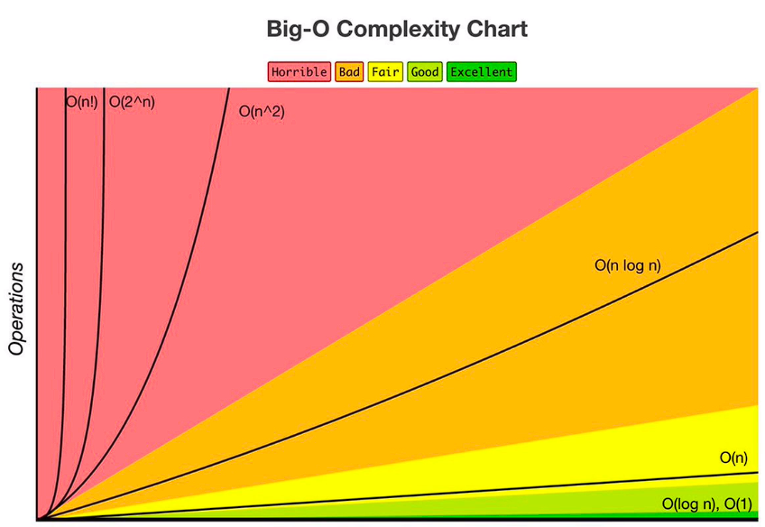
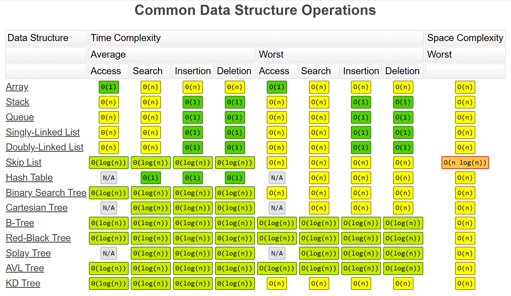
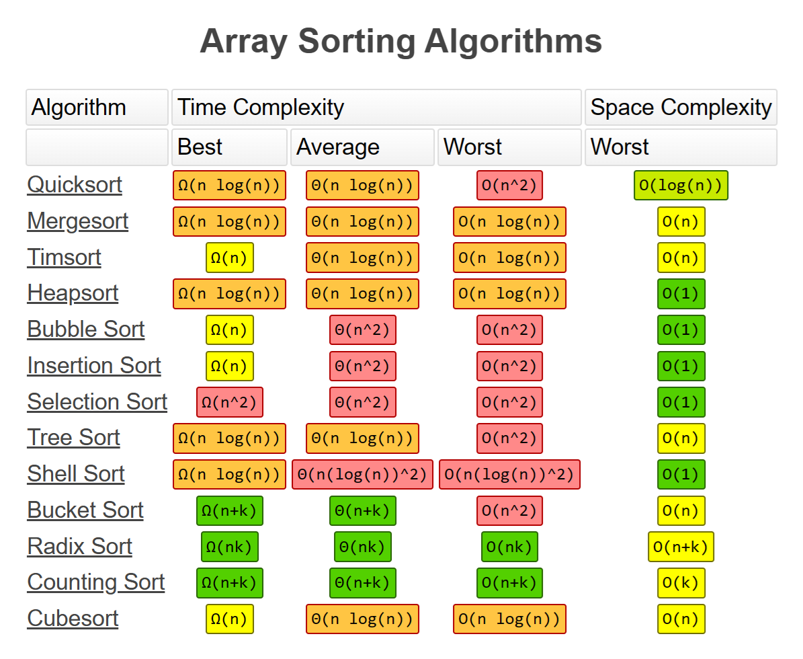

## **Big O**
- ### Describes how long a function takes to run
- ### As input size increases, how much does the function slowdown?
- ### Cheatsheet = https://www.bigocheatsheet.com/

 

## **Big O Time Complexity**
- ### **O(1)**
	- ### ***Constant***
		- ### No loops, Direct Access
- ### **O(log N)**
	- ### ***Logarithmic***
		- ### Usually searching algorithms if they are already sorted e.g. Binary Search
		- ### Problem set halved every iteration
- ### **O(n)**
	- ### ***Linear***
		- ### Single loop through all items
- ### **O(n log(n))**
	- ### ***Log Linear***
		- ### Usually divide and conquer sorting operations; merge sort, quick sort
- ### **O(n^2)**
	- ### ***Quadratic***
		- ### Nested loops
		- ### Each element in a collection is compared with every other element
- ### **O(2^n)**
	- ### ***Exponential***
		- ### Recursive algorithms that solve a problem of size (N)
- ### **O(n!)**
	- ### ***Factorial***
		- ### Adding a loop for every element

 

## **What Causes Time in a Function?**
- ### Operations (+, -, *, /)
- ### Comparisons (<, >, ==)
- ### Looping (for, while)
- ### Outside Function call (function())

 

## **Space Complexity**
- ### As input size increases, how much memory does the function require?

 

## **What Causes Space Complexity?**
- ### Variables
- ### Data Structures
- ### Function Calls
- ### Allocations