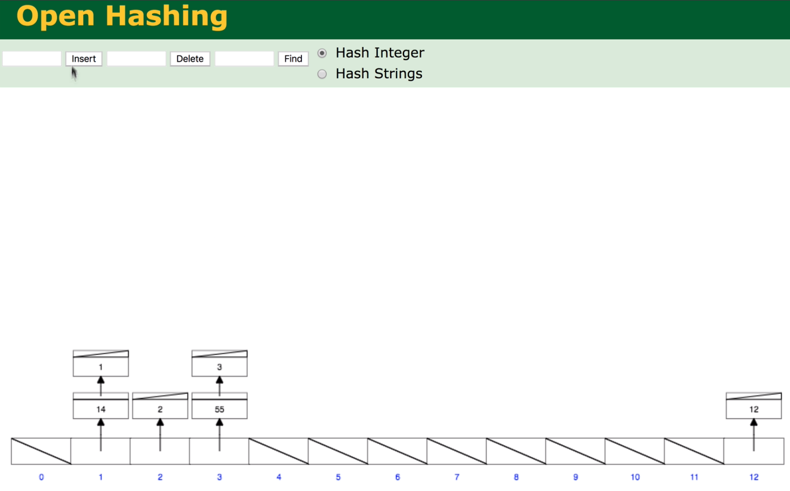
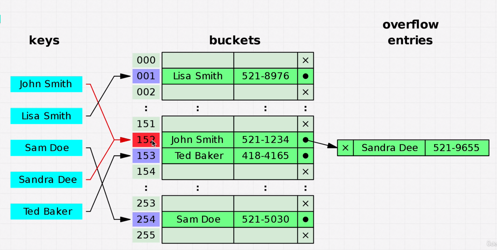
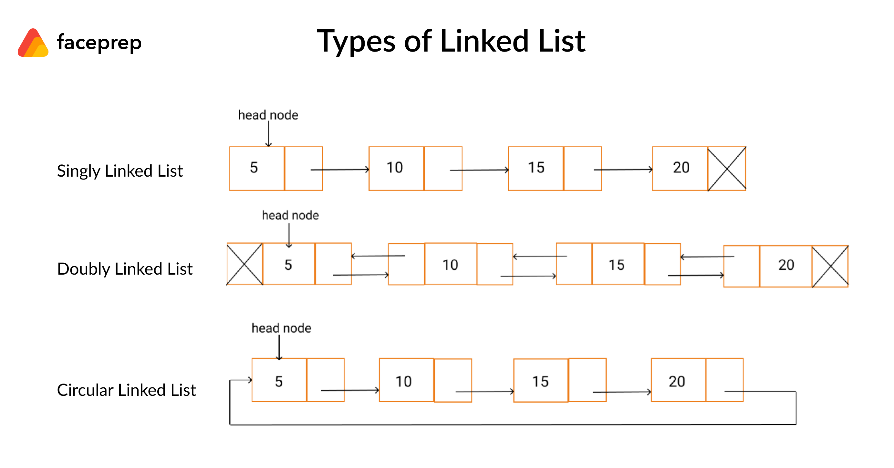
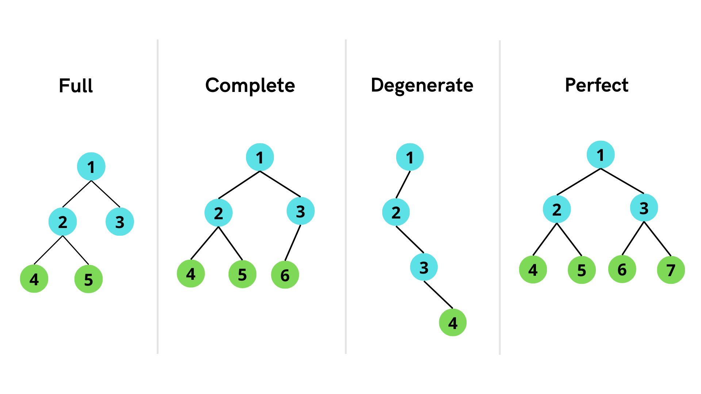
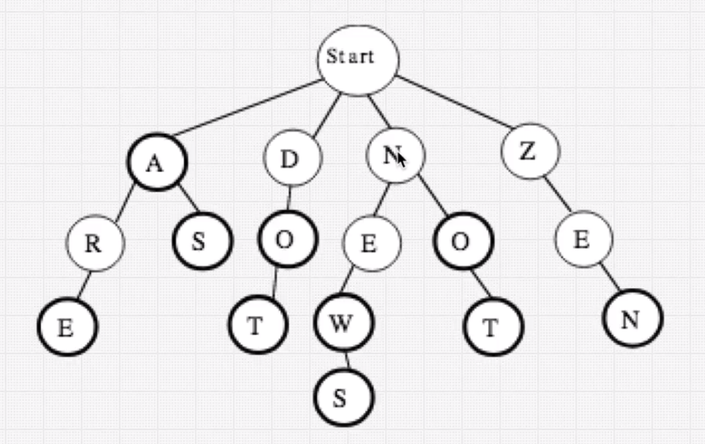
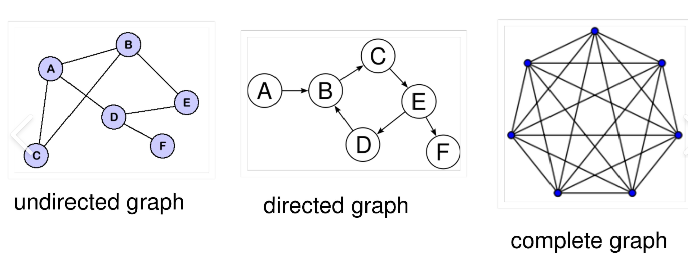

## Data Structures
- ### A collection of values, where they have relationships with each other and methods can be applied to them
- ### Each is specialized for a specific use case

 

## Array
- ### ***Example methods:***
	- ### Read = O(1)
	- ### Push = O(1)
	- ### Unshift = O(N) - ***Adding an element to beginning, means all other indexes need to be increased by 1***
	- ### Search = O(N)
	- ### Insert = O(N)
	- ### Delete = O(N)

- ### Static vs Dynamic
	- ### ***Static arrays*** = Fixed in size
	- ### ***Dynamic arrays*** = Not fixed in size
	- ### When appending to dynamic arrays, it is O(N) time because a new array is created and all elements are copied by iterating through all in original array

 

## Hash Table
- ### Known as `objects` in JS or `dictionaries` in python...
	- ### Fast Read, Insert, Delete for Key value pairs and Flexible Key names
	- ### Unordered and Slow key iteration (if you want to get all keys, have to go through all memory locations in hash table)
	- ### Frequently used for
		- ### Indexing and searching massive volumes of data. A search engine
		- ### Cache
		- ### Database indexes, enabling fast access to data based on key values
- ### ***Example methods:***
	- ### Read = O(1)
	- ### Search = O(1)
	- ### Insert = O(1)
	- ### Delete = O(1)
- ### ***Hash Function*** = Generates a value of fixed length for each input it receives
	- ### ***"One Way"*** = Original value cannot be derived from the hash value
	- ### ***"Idempotent"*** = Hash value will always be the same for the same input value
	- ### Hash Functions are used in Hash Tables, because they allow very fast data access
		- ### Hash value of an object property is converted to hexidecimal, then used as the memory address of the object value
- ### ***Hash Collision*** = Because memory is limited, it's when two different values are hashed to the same memory address, where `E.g.` a linked list is used to store the values
	- ### Limitation of Hash Tables as it increase time to access data
	- ### Makes read/write opertation O(N) time

- ### E.g.

- ### E.g.

 

## Linked List

- ### Why?
	- ### Has order unlike hash tables
	- ### Insert and Delete are more efficient than arrays
		- ### No need to copy and shift indexes, Instead just insert/delete at a node's pointer
- ### Why Not?
	- ### Traversal through a linked list is slower than an array, even though both O(N)
		- ### Node memory locations are not contiguous, unlike arrays
	- ### Direct access not possible unlike an array or hash tables
- ### Contain `nodes`, where each node has a `value` and a `pointer` to the next node (Doubly linked lists also point to the node before it)
- ### First node is `head`, last node is `tail`
- ### Are `null` terminated; where the `tail` node points to `null`
- ### 2 Types of Linked List:
	- ### `Singly linked list`
		- ### One Direction of node traversal
		- ### Requires less memory than doubly linked list
	- ### `Doubly linked list`
		- ### Both Directions of node traversal
		- ### Requires more memory than singly linked list
	
 

## Stack (FILO)
- ### Why?
	- ### Fast insert/delete at end

- ### Why not?
	- ### No direct access

- ### Can be built with either Array or Linked List

 

## Queue (FIFO)
- ### Why?
	- ### Fast insert/delete at start
		- ### More efficient than arrays as you would need to shift all indexes after removing first element

- ### Why not?
	- ### No direct access

- ### Should be built with linked list and not arrays (index shifting after popping first element is slow)

- ### Priority Queue
	- ### Each Element has a priority; higher priority elements are dequeued first

 

## Tree
- ### Why?
	- ### Searching, Inserting, Deleting are O(log N) time (assuming a balanced tree)
	- ### Hierarchical data

- ### Why not?
	- ### Memory overhead
	- ### Inefficient for sorting
	- ### No O(1) operations on average (unless root lookup)

- ### Traverse down from Root node at the top

- ### Child nodes only have one parent node

- ### Nodes can only point to children nodes

- ### Leaf nodes are those that don't have children nodes

 

- ### ***Binary Tree***

- ### Each node can only have 0, 1 or 2 children nodes
	- ### `Full` = All nodes have 0 or 2 children
	- ### `Complete` = All levels are filled except possibly the last level, which is filled from left to right
	- ### `Degenerate`/`Unbalanced` = Each parent node has only one child node
	- ### `Perfect` (Efficient for searching)
		- ### Number of nodes doubles each level
		- ### Number of nodes on the last level equals number of all other nodes + 1; meaning around half of the nodes are leaf nodes
- ### Binary Search Tree
	- ### Left child value is less than parent; Right child value is larger than parent
	- ### Want to avoid `Unbalanced` BSTs, because they are O(N) time for search, insert, delete; instead of O(log N)
- ### AVL Tree (Automatic balancing of BST)
	- ### The difference between heights of left and right subtrees for any node cannot be more than one
	- ### 4 ways to keep itself balanced:
		- ### Left Rotation
		- ### Right Rotation
		- ### Left-Right Rotation
		- ### Right-Left Rotation
- ### Red Black Tree (Automatic balancing of BST)
	- ### A binary search tree with one extra attribute for each node: the colour; either red or black
	- ### Every node is either red or black.
	- ### Every leaf is black
	- ### If a node is red, then both its children are black.
	- ### Every simple path from a node to a descendant leaf contains the same number of black nodes
- ### Binary Heap
	- ### Left or Right values must be less than parent, but left doesn't have to be less than right
	- ### Left to Right insertion; automatically balances itself
		- ### Preserves the order of insertion (Useful for Priority Queues)
	- ### Good for comparitive operations e.g. Values larger than X
- ### Trie
	- ### Optimizing searching for text (If a word/char exists in some text)
		- ### Autocomplete
	- ### Not a binary tree, each node can have multiple children

 

## Graph

- ### Why?
	- ### Model complex real world relationships
	- ### Find the shortest path between two points using weighted directional graphs
- ### Why not?
	- ### Scalability
		- ### As the number of nodes and edges in a graph increases, the processing time and memory required to analyze it also increases
	- ### Limited representation
		- ### Graphs only represent relationships between objects, and not their properties or attributes. This means that to fully understand the data, supplementing the graph with additional information is required
- ### `Nodes` that can have multiple parents and children nodes connected by `edges`
- ### `Directed` Graphs have edges with a direction, `Undirected` Graphs edges can **always** be traversed in both directions
- ### `Weighted` Graphs have values/information on edges (E.g. used to calculate most optimal path), `Unweighted` Graphs don't
- ### `Cyclic` Graphs have at least 1 cycle, `Acyclic` Graphs don't